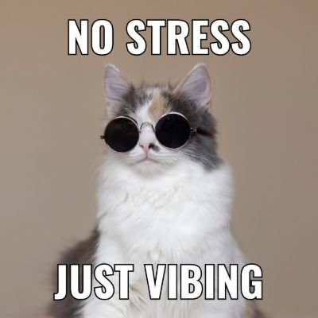

# Creative Coding Python spring 2025
this repo is where i store my projects made in creative coding python

## what i am learnging in this class/ what i made in this class
- data visualization
- live coding
<!-- - python drawing -->

[my github](https://github.com/leey611)

<!--  -->

<!--  -->